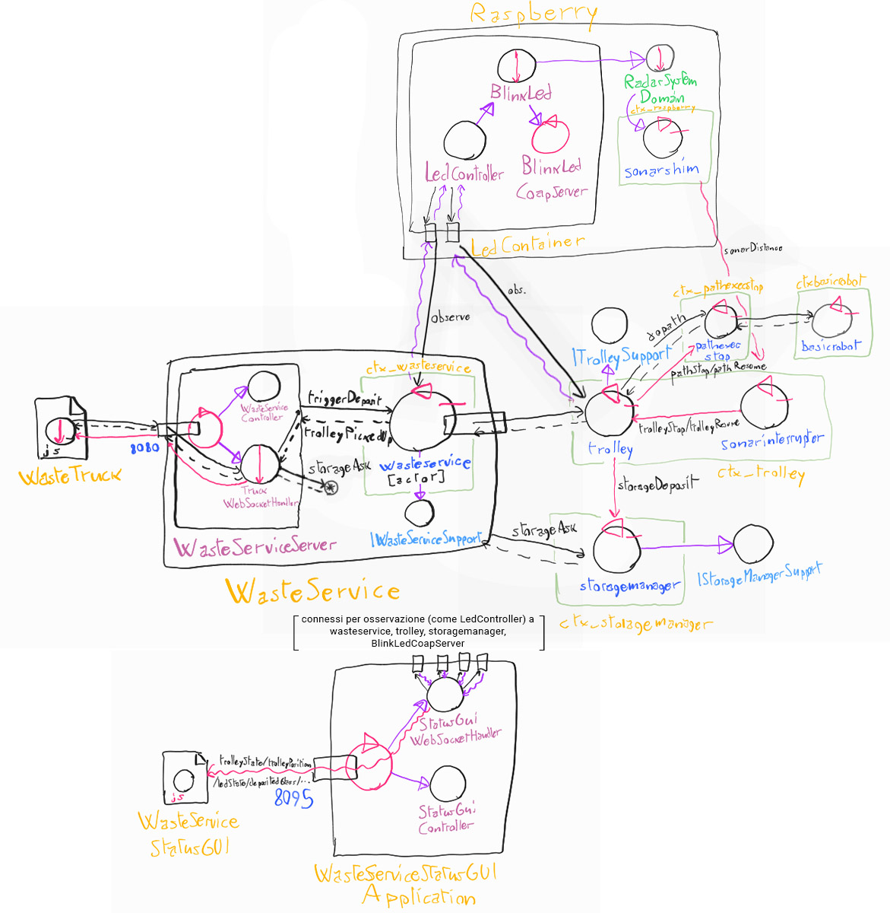

# WasteService - Conclusioni

##### F. Lenzi, L. Guerra

.. toc::
    :depth: 2

Il progetto WasteService è stato completato in tre SPRINT SCRUM, al termine dei quali il progetto aveva la seguente struttura:

## Demo

Viene incluso in seguito un video di una demo del progetto in contesto distribuito:

[Demo WasteService Lenzi Guerra](https://youtu.be/wizYutGEHh4)

I componenti erano distribuiti nel modo seguente:

- WasteService e WasteServiceStatusGUI su macchina in rete diversa (schermo visibile tramite condivisione in videochiamata)
- Led e Sonar su un Raspberry PI (ripreso dalla fotocamera)
- Trolley e StorageManager sul PC Desktop inquadrato, con altra istanza da browser di WasteServiceStatusGUI

## Test

Sono elencati di seguito i test per verificare la corretta reificazione dei vari requisiti del committente, e il funzionamento dei componenti aggiunti in fase di analisi e di progetto:

- **TestRequest**: [TestRequest.kt](../wasteservice.core/test/it/unibo/lenziguerra/wasteservice/wasteservice/TestRequest.kt)
- **TestDeposit**: [TestDeposit.kt](../wasteservice.core/test/it/unibo/lenziguerra/wasteservice/TestDeposit.kt)
- **TrolleyTest**: [TrolleyTest.kt](../wasteservice.core/test/it/unibo/lenziguerra/wasteservice/TrolleyTest.kt)
- **TestMoreRequests**: [TestMoreRequests.kt](../wasteservice.core/test/it/unibo/lenziguerra/wasteservice/TestMoreRequests.kt)

- **TestGui**: [TestGui.kt](../wasteservice.statusgui/src/test/kotlin/it/unibo/lenziguerra/wasteservice/statusgui/TestGui.kt)
- **TestLed**: [TestLed.kt](../wasteservice.led/src/test/kotlin/TestLed.kt)
- **BlinkLedTest**: [BlinkLedTest.kt](../wasteservice.led/src/test/kotlin/BlinkLedTest.kt)

- **TestSonarStop**: [TestSonarStop.kt](../wasteservice.core/test/it/unibo/lenziguerra/wasteservice/TestSonarStop.kt). Funzionamento analogo all'analisi del problema.
- **TestSonarShim**: [TestSonarShim.kt](../wasteservice.sonar/test/it/unibo/lenziguerra/wasteservice/sonar/TestSonarShim.kt). Ora eseguibile, sfrutta la modalità testing del SonarMock di radarsystem.domain per controllare gli output del Sonar.

### Deployment

Vengono forniti i file docker-compose elencati in seguito. Ci si può connettere alla porta 8080 per aprire l'interfaccia per i WasteTruck usata per inviare richieste, alla porta 8090 per visualizzare l'ambiente virtuale del robot, e alla porta 8095 per visualizzare WasteServiceStatusGUI.

- [wasteservice3\_withmockgui.yaml](../wasteservice3_withmockgui.yaml): esegue tutto il sistema in locale, usando la webapp *raspGui* menzionata precedentemente come mock di Led e Sonar, accessibile alla porta 8096.

- [wasteservice3_norasp.yaml](../wasteservice3_norasp.yaml): esegue il sistema senza le componenti Led e Sonar; esse vanno eseguite fuori da Docker sul Raspberry Pi, il quale IP va configurato dentro a questo file yaml nel campo **wasteservice.led** sotto **extra_hosts** del servizio **wasteservice.statusgui**. Per trasferire facilmente i file di distribuzione al Raspberry Pi vengono forniti gli script **scpDistrToRasp.sh** in [wasteservice.led](../wasteservice.led/scpDistrToRasp.sh) e [wasteservice.sonar](../wasteservice.sonar/scpDistrToRasp.sh), dove occorre configurare l'hostname/IP del raspberry al posto di `raspi` nei vari comandi.

Le porte usate dal sistema sono le seguenti, a scopo di reindirizzamento e apertura delle porte:

- 8020 TCP/UDP: BasicRobot22 (contesto)
- 8023 TCP/UDP: WasteService (contesto)
- 8025 TCP/UDP: PathexecStop (contesto)
- 8030 UDP: Led (server Coap per osservabilità)
- 8031 TCP/UDP: SonarShim (contesto)
- 8070 TCP/UDP: Trolley (contesto)
- 8071 TCP/UDP: StorageManager (contesto)
- 8080 TCP: WasteService (da browser, TruckGUI, per inviare richieste da un camion)
- 8090 TCP: VirtualRobot (da browser, ambiente virtuale per BasicRobot)
- 8095 TCP: WasteServiceStatusGUI (da browser)
- (8096 TCP/UDP: RaspGUI (da browser, per testing) )