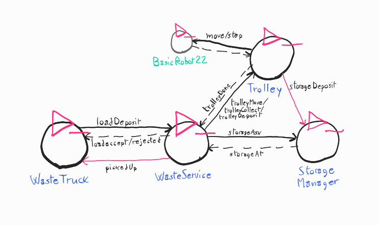
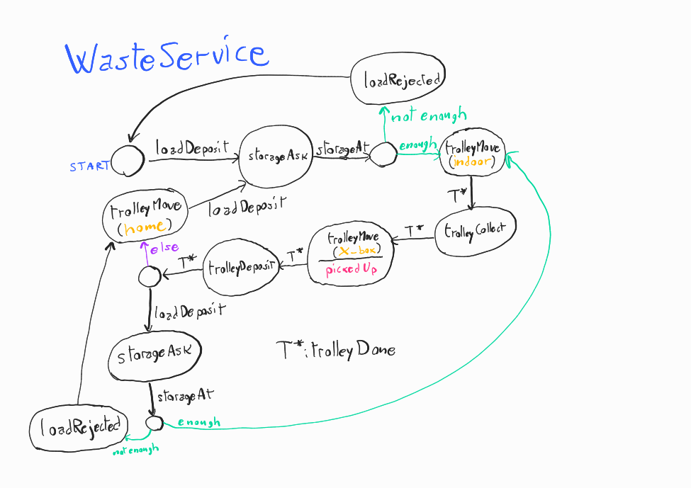

## Riassunto SPRINT 1

Questo primo SPRINT riguardava questi requisiti:

- **request**: il *WasteService* accetta richieste di deposito da *Waste truck* che arrivano nella zona specificata come INDOOR, che specificicano il tipo di materiale da depositare.
- **deposit**: il *trolley*, quando viene attivato, raccoglie i materiali a INDOOR, e li deposita, in base al tipo, in GLASS BOX o PLASTIC BOX; questa è una *deposit action*.
- **indoor-more-requests**: il *trolley*, terminata una *deposit action*, torna a HOME solo se non ci sono altre richieste da gestire, altrimenti gestisce subito la richiesta successiva andando a INDOOR.

### Analisi

Dopo la fase di analisi, l'architettura logica del sistema è stata così pensata:

[**Prototipo eseguibile**](../wasteservice.prototype/src/prototype_sprint1.qak)

Il sistema è stato pensato per usare la componente esterna BasicRobot22, per semplificare le interazioni con robot reali e virtuali.

Sono stati realizzati, in fase di analisi, dei test plan già eseguibili sfruttando il prototipo in Qak, per ogni requisito. Sono dettagliati nella sezione apposita, e collegati di seguito:

- [TestRequest.java](../wasteservice.prototype/test/it/unibo/TestRequest.java)
- [TestDeposit.java](../wasteservice.prototype/test/it/unibo/TestDeposit.java)
- [TestMoreRequests.java](../wasteservice.prototype/test/it/unibo/TestMoreRequests.java)

### Progetto

I punti salienti della fase di sviluppo sono i seguenti:

- L'interfaccia per permettere ai WasteTruck è stata realizzata come applicazione web tramite il framework SpringBoot, che comunica con il sistema tramite WebSocket.

- WasteService è stato realizzato come due componenti distinte e collegate: un server web Spring Boot che fornisce la pagina per fare richieste e le gestisce, e un attore Qak che coordina la *deposit action* del Trolley.

- Il Trolley realizza il movimento interagendo con BasicRobot22, in particolare l'attore *pathexec*. Trolley genera il percorso per la destinazione, e lo invia a quest'ultimo attore.

- Ogni attore è una risorsa osservabile COaP con dati utili, permettendo più facile testing e futura espandibilità.

<immagine architettura>

I test dell'analisi sono stati adattati all'implementazione:

- [TestRequest.java](../wasteservice.core/test/it/unibo/lenziguerra/wasteservice/wasteservice/TestRequest.java)
- [TestDeposit.java](../wasteservice.core/test/it/unibo/lenziguerra/wasteservice/TestDeposit.java)
- [TestMoreRequests.java](../wasteservice.core/test/it/unibo/lenziguerra/wasteservice/TestMoreRequests.java)

Note sull'esecuzione: 

* È necessario avviare BasicRobot22 prima di eseguire i test, è incluso un [file docker](../wasteservice.core/basicrobot22.yaml) per farlo facilmente, con le impostazioni della mappa che seguono il dominio del problema.
* I test vanno avviati un metodo alla volta, ed è necessario aggiornare la pagina di VirtualEnv di BasicRobot tra le esecuzioni, a causa di requisiti di VirtualEnv e Qak.

Viene anche fornita un'**immagine Docker** per avviare il sistema in modo semplice: [wasteservice.yaml](../wasteservice.core/wasteservice.yaml).