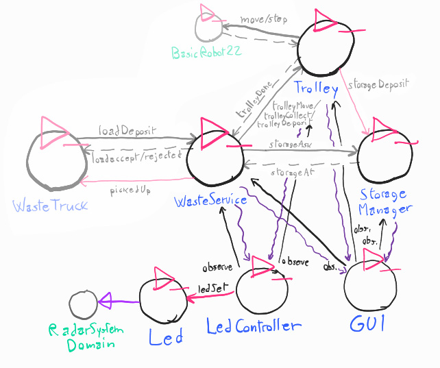

## Analisi del problema

### Componenti

#### Requisito **led** - componenti

Emergono due opzioni principali su come gestire il Led:

- Usare un solo attore LedActor, che gestisce sia i dati di dominio, e interagisce direttamente con il dispositivo. Quindi, questo singolo componente riceverebbe i dati dello stato del Trolley, e si occuperebbe di accensione e spegnimento del Led.

- Dividere gli incarichi tra due componenti: LedActor, che interagirebbe con il dispositivo tramite la libreria in base a istruzioni ricevute dall'esterno, e LedController, che riceverebbe i dati dello stato del trolley e interagirebbe con LedActor.

**Conclusione.** Si ritiene migliore la seconda opzione, vale a dire **dividere gli incarichi**, visto che rispetta il principio di singola responsabilità. Inoltre, permetterebbe il riutilizzo dell'attore LedActor in altri contesti, essendo agnostico al dominio.

### Interazione

Il problema della comunicazione per **led** e **gui** è analogo, quindi verranno analizzati insieme.

Escludendo di usare comunicazione punto-punto come dispatch e richieste, data la scarsa espandibilità, e la complicazione nella necessità di modificare ogni attore da analizzare, le opzioni attuali sono due:

- Usare eventi: si potrebbero aggiungere emissioni di eventi contenenti i dati di stato attuale dei vari attori di interesse per Led e WasteServiceStatusGui, incluso il Led i cui dati sono visualizzati dalla Gui.

    ```
    Event trolleyStatus : trolleyStatus(STATUS,POS)
    Event storageStatus : storageStatus(CONTENTS)
    Event ledStatus : ledStatus(STATUS) //on|blink|off
    ```

- Osservabilità: come detto nel progetto dello SPRINT 1, i vari attori sono osservabili tramite COAP. Quindi un'opzione sarebbe rendere Led e WasteServiceStatusGui osservatori degli attori rilevanti (e rendere osservabile il Led), e aggiungere alle informazioni osservabili degli attori di interesse eventuali dati mancanti.

**Conclusione.** Viene ritenuta come opzione migliore la seconda, l'**osservabilità**, visto che gli attori creati nello SPRINT 1 sono già risorse osservabili con le informazioni necessarie; quindi, non sarebbe necessaria alcuna modifica al software già sviluppato per adempiere a questo requisito, il che sarebbe un grande vantaggio. Inoltre, il fatto che COAP sia un protocollo già definito renderebbe ancora più facile l'estendibilità.

In luce di queste considerazioni, sono quindi aggiornati i modelli eseguibili di Led e Gui:

* [Modello eseguibile Led](../model.problema/src/pro_led.qak)
* [Modello eseguibile Gui](../model.problema/src/pro_gui.qak)

Per realizzarli, è stata sviluppata una utility per Qak per permettere agli attori di agire da osservatori, oltre che da risorse osservabili. Ulteriori dettagli sono presenti nel file [qakactor.observer.md](qakactor.observer.md).

### Posizione trolley

La posizione del Trolley, come da analisi dello Sprint 1, non è ad esso nota in termini di nomi del dominio ("home", "indoor", ecc.) essendo esso usato come "attuatore", ma solo in termini di coordinate numeriche. La componente che conosce la posizione del Trolley in termini di nomi dei luoghi è WasteService.

Dovendo Gui conoscere la posizione del Trolley in termini di nomi dei luoghi, si pongono due possibilità: 

- Gui potrebbe osservare anche WasteService, che comunque già fornisce questa informazione come risorsa.

- Gui potrebbe continuare a osservare solo Trolley, e decodificare il nome delle posizioni dalla configurazione.

**Conclusioni.** È stato deciso il primo approccio, ritenuto più vicino al principio di singola responsabilità; invece di mettere la logica di rilevazione del luogo dalla posizione in più componenti, la si mette in un componente solo (WasteService) e si chiede ad esso lo stato attuale del dato.

Led ha un problema simile, cioè sapere se Trolley si trovi a HOME o meno: viene usata una soluzione analoga.

### Architettura Logica

Ecco quindi l'architettura logica finale del sistema in generale per questo SPRINT:



[**Modello eseguibile generale / prototipo.**](../wasteservice.prototype/src/prototype_sprint2.qak) Si noti come rispetto al modello eseguibile dello Sprint1, non sia stato necessario modificare niente del codice preesistente ma sia bastato aggiungere gli attori-osservatori.

### Test Plan

#### TestPlan: led

Test plan in Kotlin: [TestLed.kt](../wasteservice.prototype/test/it/unibo/TestLed.kt)

- **Test Led**: creazione di server COAP "fasullo" allo stesso indirizzo del contesto del sistema principale osservato. Invio di dati che portano ai vari stati del Led, poi verifica che questi stati siano stati raggiunti.


#### TestPlan: gui

Test plan in Kotlin: [TestGui.kt](../wasteservice.prototype/test/it/unibo/TestGui.kt)

- **Test Gui**: creazione di server COAP "fasullo" allo stesso indirizzo del contesto del sistema principale osservato. Invio di dati che portano a vari stati della Gui, e verifica che la pagina risultante venga modificata correttamente.
