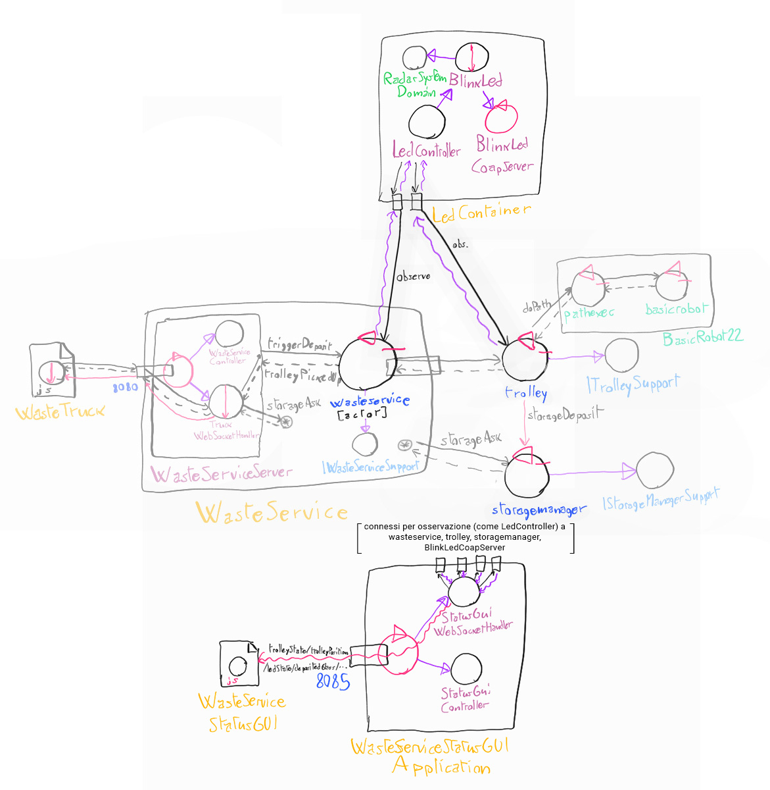

## Progettazione

La progettazione e lo sviluppo delle componenti software stabilite in fase di analisi è stata divisa in questo modo:

- BlinkLed, LedController: F. Lenzi
- WasteServiceStatusGUI: L. Guerra

### Struttura del software

Dato che entrambi i componenti non interagivano con il sistema Qak se non tramite l'osservazione della risorsa server COaP, sono stati realizzati come **semplici oggetti**, non attori, dotati di capacità di osservazione mediante una `CoapConnection` (libreria *unibo.comm22*) che sfrutta la libreria Californium per Coap.

Questo permette di semplificare abbastanza la struttura, non richiedendo contesti di attori e conseguenti adattatori observer-attore come quello realizzato per rappresentare il modello dell'analisi. Infatti, i progetti dei due componenti non includono o conoscono neanche il framework Qak.

I componenti sono stati contenuti in due nuovi progetti:

- *wasteservice.led*: contiene le classi corrispondenti a BlinkLed e LedController.
- *wasteservice.statusgui*: contiene il server Spring Boot che gestisce la WasteServiceGUI.

La struttura dei package diventa la seguente (evidenziati solo i cambiamenti importanti):

- wasteservice.shared
    - *it.unibo.lenziguerra.wasteservice* (aggiunti nuovi enumerativi, test fixture, e classi minori)
    - it.unibo.lenziguerra.wasteservice.utils
    - \+ *it.unibo.lenziguerra.wasteservice.data* (classi dati, vedi sotto)
- wasteservice.core
    - it.unibo.lenziguerra.wasteservice.wasteservice
    - it.unibo.lenziguerra.wasteservice.trolley
    - it.unibo.lenziguerra.wasteservice.storage
    - *`wasteservice.qak`* (uso delle nuove classi dati)
- **wasteservice.led**
    - *it.unibo.lenziguerra.wasteservice.led*
- **wasteservice.statusgui**
    - *it.unibo.lenziguerra.wasteservice.statusgui*

### Classi dati

Come da analisi, non sarebbe servito modificare il progetto core per permettere il funzionamento dei nuovi componenti, essendo gli attori già impostati per essere osservabili con dati rilevanti. Sono state comunque fatte modifiche minori, soprattutto per usare le **classi dati** aggiunte in questo SPRINT.

Per strutturare in modo più semplice e consistente il formato dei dati contenuti nelle risorse osservabili COaP, questi dati sono stati incapsulati in apposite *data class* Kotlin, contenute in *wasteservice.shared:it.unibo.lenziguerra.wasteservice.data*. Esse hanno metodi `fromProlog` e `toString` per convertire i dati da stringa osservata a dato di dominio, con enumerativi vari rilevanti:

```Kotlin
data class TrolleyStatus (val status: State, val pos: Array<Int>, val contentType: WasteType?, val contentAmount: Float) {
    enum class State {
        WORK, STOPPED
    }

    companion object {
        fun fromProlog(prolStr: String): TrolleyStatus {
           [...]
        }
    }

    override fun toString(): String {
        return "state(${status.toString().lowercase()})\npos(${pos[0]},${pos[1]})" +
                (contentType?.let { "\ncontent($contentType,$contentAmount)" } ?: "")
    }
}
```

La stringa restituita da queste classi è quella che viene passata a `updateResource` nei vari attori (o equivalente per il Led).

### Led

Il led, come da analisi, viene gestito tramite la libreria già realizzata *it.unibo.radarSystem22.domain*, che a sua volta interagisce con il software del committente (*led25GpioTurnOn.sh* e *led25GpioTurnOff.sh*).

Come sopra i due componenti da analisi (BlinkLed e LedController) sono realizzati non come attori Qak, ma come POJO. In particolare, vengono realizate queste classi:

- **BlinkLed**: wrapper per le classi di *radarSystem22.domain*, che permette di impostare il led, oltre che ad acceso o spento, a uno stato di lampeggiamento, ed è osservabile. Analogo all'attore BlinkLed in analisi.

- **LedController**: analogo a LedController in analisi, controlla un BlinkLed e osserva Trolley e WasteService.

- **BlinkLedCoapServer**: un server COaP standalone, per rendere osservabile il BlinkLed come risorsa.

- **LedContainer**: integra il sotto-sistema, istanziando e collegando i vari componenti.

#### BlinkLed

Da requisiti, il led deve poter essere impostato in stato di lampeggiamento, acceso, o spento, realizzando le primitive *turnOn*, *turnOff*, e *blink*. L'interfaccia della classe BlinkLed, `IBlinkLed`, è quindi la seguente:

```Kotlin
interface IBlinkLed {
    fun turnOn()
    fun turnOff()
    fun blink()

    val status: BlinkLedState
    var updateHandler: ((BlinkLedState) -> Unit)?
}
```

`BlinkLedState` è un nuovo enumerativo che corrisponde ai tre stati possibili. La funzione updateHandler, invece, è un callback che può essere impostato per rendere osservabile il `BlinkLed`, chiamato a ogni cambiamento di stato.

Il lampeggiamento in `BlinkLed` è realizzato creando un thread apposito al cambiamento di stato:

```Kotlin
BlinkLedState.BLINKING -> thread {
    while (status == BlinkLedState.BLINKING) {
        led.turnOn()
        CommUtils.delay(500)
        led.turnOff()
        CommUtils.delay(500)
    }
}
```

esso non viene attivato se il Led sta già lampeggiando.

#### LedController

`LedController` riceve un `IBlinkLed`, e crea due connessioni Coap con il contesto Qak di *wasteservice.core* per osservare lo stato sia di WasteService che di Trolley, come da analisi. Il funzionamento è analogo all'attore dell'analisi, con due handler Coap per gestire le due risorse osservate.

#### BlinkLedCoapServer

`BlinkLedCoapServer` è un semplice wrapper per `CoapServer` di Californium, che contiene una `CoapResourceBlinkLed`, contenente un riferimento a `ILed`. Offre una funzione sendUpdates che invia aggiornamenti a tutti gli Observer della risorsa connessi. Espone la risorsa all'Uri */led*.

#### LedContainer

`LedContainer` si limita a configurare i vari componenti e istanziarli, e offrire il punto di ingresso del sistema. Il main, infatti, è lì contenuto. In particolare, crea un istanza di `ILed` di *radarSystem22.domain* reale o mock in base alla configurazione della libreria, contenuta in *DomainSystemConfig.json*. 

Inoltre, rende il led osservabile impostando il callback per lanciare *sendUpdates* nel `BlinkLedCoapServer`:

```Kotlin
led.updateHandler = { ledServer.sendUpdates() }
```

### WasteServiceStatusGUI

Come da analisi, WasteServiceStatusGUI è stata implementata come web application. Il server web è realizzato, come per WasteService, tramite il framework Spring Boot. In particolare, la pagina web rimane connessa al server tramite *WebSocket*, per permettere aggiornamenti in diretta dei dati da monitorare senza aggiornare la pagina.

L'osservazione dei dati è svolta dal `WebSocketHandler` Spring che gestisce le connessioni, implementato nella classe `StatusGuiWebsocketHandler`.

#### StatusGuiWebsocketHandler

`StatusGuiWebsocketHandler` tiene traccia di ogni sessione di WebSocket attualmente attiva, e contiene le 4 `CoapConnection` ai componenti del sistema osservati (gli attori *wasteservice*, *trolley*, *storagemanager* e il `BlinkLedCoapServer`), ciascuna gestita da un Observer. Gli Observer inviano a ogni sessione WebSocket attiva aggiornamenti sui dati ogni volta che la risorsa osservata cambia.

L'handler in sè accetta un unico input da parte delle sessioni di WebSocket, vale a dire la stringa *get*, alla quale risponde con aggiornamenti su tutti i dati. Questa viene usata al caricamento della pagina per inizializzare la StatusGUI.

#### Observer

Gli observer sono estensioni di `CoapHandler` della libreria Californium, una classe per ogni risorsa osservata. Le classi sono presenti nel file [Observers.kt](../wasteservice.statusgui/src/main/kotlin/it/unibo/lenziguerra/wasteservice/statusgui/Observers.kt). Ogni observer contiene un riferimento alla lista di sessioni WebSocket attive, e invia aggiornamenti alla ricezione dei dati.

### Altro

Sono state fatte altre modifiche minori a *wasteservice.core* e *wasteservice.shared*:

- Aggiunto un dispatch *updateState* a Trolley per impostare il suo stato a *stopped* in caso di errore.
- Aggiunto gruppo source *testFixtures* in *wasteservice.shared* per condividere librerie di testing con gli altri progetti senza includerle nella versione di distribuzione.
- Correzione all'uso di `WebSocketHandler` di Spring Boot in `WasteServiceServer` per coerenza con StatusGUI, usa *@Component* e *@AutoWired* per evitare di inizializzare l'handler 2 volte con Spring.

### Test

I test dell'analisi sono stati adattati al sistema, funzionando nello stesso modo, cioè creazione di contesto Qak con attori mock la cui risorsa viene arbitrariamente pilotata nel test e osservata dai componenti da testare. TestGui è eseguibile anche dalla classe di test, senza dover per forza eseguire un test alla volta. 

I test possono inoltre essere eseguiti senza avviare nessun software oltre al test, invece di richiedere WEnv/BasicRobot come nello SPRINT precedente. Questo grazie alla maggiore flessibilità data dalla struttura ad Observer.

- [TestGui.kt](../wasteservice.statusgui/src/test/kotlin/it/unibo/lenziguerra/wasteservice/statusgui/TestGui.kt)
- [TestLed.kt](../wasteservice.led/src/test/kotlin/TestLed.kt)

È stato inoltre aggiunto un test per verificare il corretto funzionamento del lampeggiamento in BlinkLed:

- [BlinkLedTest.kt](../wasteservice.led/src/test/kotlin/BlinkLedTest.kt)

### Struttura del sistema

La struttura finale del sistema nello SPRINT 2 è riassunta in questo grafico: 



Le connessioni di WasteServiceStatusGUI sono riassunte per testo per semplificare il grafico.

### Immagine Docker

Vengono forniti i file Docker-compose elencati in seguito. Ci si può connettere alla porta 8080 per aprire l'interfaccia per i WasteTruck usata per inviare richieste, alla porta 8090 per visualizzare l'ambiente virtuale del robot, e alla porta 8095 per visualizzare WasteServiceStatusGUI.

- [wasteservice2_withledmock.yaml](../wasteservice2_withledmock.yaml): esegue tutto il sistema in locale, usando un mock per il Led che stampa lo stato attuale su standard output.

- [wasteservice2_noled.yaml](../wasteservice2_noled.yaml): esegue il sistema senza la parte di wasteservice.led; essa va eseguita fuori da Docker sul Raspberry Pi, il quale IP va configurato dentro a questo file yaml nel campo **wasteservice.led** sotto **extra_hosts** del servizio **wasteservice.statusgui**. Per trasferire facilmente i file di distribuzione al Raspberry Pi viene fornito lo script [scpDistrToRasp.sh](../wasteservice.led/scpDistrToRasp.sh), dove occorre configurare l'hostname/IP del raspberry al posto di `raspi` nei vari comandi.

