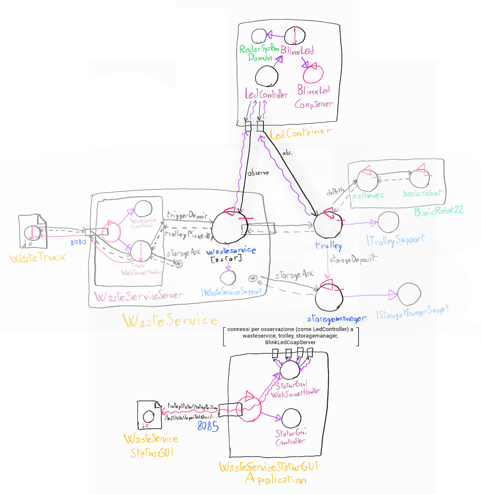

## Riassunto SPRINT 2

Il secondo SPRINT riguardava questi requisiti:

- **led**: nel sistema è presente un led che:
    - è *acceso* se il *trolley* è a HOME
    - *lampeggia* se il *trolley* è in attività
    - è *spento* se il trolley è in stato di *stop*
- **gui**: è presente una gui (*WasteServiceStatusGUI*) che mostra i seguenti dati:
    - Stato del *trolley* e sua posizione

### Analisi

In fase di analisi, è stato deciso di realizzare i due nuovi componenti sfruttando il pattern Observer, rendendoli Observer delle risorse osservabili realizzate nello SPRINT 1.

Dopo la fase di analisi, l'architettura logica del sistema è stata così pensata:

[**Modello eseguibile generale / prototipo.**](../wasteservice.prototype/src/prototype_sprint2.qak) Si noti come rispetto al modello eseguibile dello SPRINT 1, non sia stato necessario modificare niente del codice preesistente ma sia bastato aggiungere gli attori-osservatori.

È stato realizzato un supporto a Qak per rendere un attore Observer di altri attori o risorse Coap, [qakactor.observer](qakactor.observer.md).

Sono usati per interagire con il led i componenti forniti dal committente, *led25GpioTurnOn.sh* e *led25GpioTurnOff.sh*, controllati con la libreria *it.unibo.radarSystem22.domain* realizzata per progetti precedenti.

Sono stati realizzati, in fase di analisi, dei test plan già eseguibili sfruttando il prototipo in Qak, per ogni requisito. Sono dettagliati nella sezione apposita, e collegati di seguito:

- [TestLed.kt](../wasteservice.prototype/test/it/unibo/TestLed.kt)
- [TestGui.kt](../wasteservice.prototype/test/it/unibo/TestGui.kt). Nota: lanciare un test alla volta, a causa di interazioni tra Qak e JUnit.

### Progetto

I punti salienti della fase di sviluppo sono i seguenti:

- Sono state realizzate *data class* per standardizzare i dati contenuti nelle risorse osservabili Coap.

- Sia il sotto-sistema di *wasteservice.led* che quello di *wasteservice.gui* sono realizzati non usando il framework Qak, dato che l'interazione con il sistema centrale è limitata all'osservazione tramite connessioni Coap, il che semplifica la realizzazione dei due sotto-sistemi.

- *wasteservice.led* è un componente passivo, costituito da vari POJO, che osserva le risorse Trolley e WasteService e gestisce il led di conseguenza.

- *wasteservice.gui* è realizzato come webserver Spring Boot che serve una webapp, che viene aggiornata tramite WebSocket dagli Observer delle varie risorse osservate.

I test dell'analisi sono stati adattati all'implementazione:

- [TestGui.kt](../wasteservice.statusgui/src/test/kotlin/it/unibo/lenziguerra/wasteservice/statusgui/TestGui.kt)
- [TestLed.kt](../wasteservice.led/src/test/kotlin/TestLed.kt)

Possono essere eseguiti senza lanciare programmi esterni, a differenza dei test dello SPRINT 1.

Vengono forniti i file Docker-compose elencati in seguito. Ci si può connettere alla porta 8080 per aprire l'interfaccia per i WasteTruck usata per inviare richieste alla porta 8090 per visualizzare l'ambiente virtuale del robot e alla porta 8095 per visualizzare WasteServiceStatusGUI.

- [wasteservice2_withledmock.yaml](../wasteservice2_withledmock.yaml): esegue tutto il sistema in locale, usando un mock per il Led che stampa lo stato attuale su standard output.

- [wasteservice2_noled.yaml](../wasteservice2_noled.yaml): esegue il sistema senza la parte di wasteservice.led; essa va eseguita fuori da Docker sul Raspberry Pi, il quale IP va configurato dentro a questo file yaml nel campo **wasteservice.led** sotto **extra_hosts** del servizio **wasteservice.statusgui**. Per trasferire facilmente i file di distribuzione al Raspberry Pi viene fornito lo script [scpDistrToRasp.sh](../wasteservice.led/scpDistrToRasp.sh), dove occorre configurare l'hostname/IP del raspberry al posto di `raspi` nei vari comandi.

