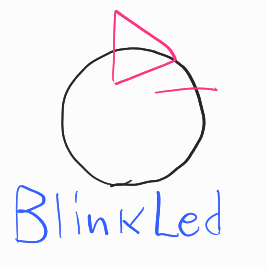
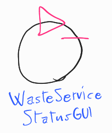

[Ritorna all'inizio](../README.md)

# WasteService - Analisi dei Requisiti

Per ogni requisito analizzato in questo SPRINT è stato incluso un modello eseguibile in [Qak](#scelta-del-linguaggio-di-modellazione). 

## Requisiti e chiarimenti

- **request**: il *WasteService* accetta richieste di deposito da *Waste truck* che arrivano nella zona specificata come INDOOR, che specificicano il tipo di materiale da depositare
    - il sistema può controllare se c'è spazio per un certo materiale: accetta (risposta *loadaccept*), e rifiuta (risposta *loadrejected*) le richieste di deposito in caso contrario
    1. > Domanda: le richieste possono essere gestite anche mentre il robot è in attività?

        Sì, potrebbe arrivare altro camion che chiede.

    2. > Domanda: solo un camion alla volta in INDOOR?

        Sì.

- **deposit**: il *trolley*, quando viene attivato, raccoglie i materiali a INDOOR, e li deposita, in base al tipo, in GLASS BOX o PLASTIC BOX; questa è una *deposit action*:
    1. Raccolta di rifiuti da *Waste truck* in INDOOR
    2. Andare da INDOOR a contenitore rifiuti (* BOX)
    3. Depositare rifiuti nel contenitore

- **indoor-more-requests**: il *trolley*, terminata una *deposit action*, torna a HOME solo se non ci sono altre richieste da gestire, sennò gestisce subito la richiesta successiva andando a INDOOR

- **led**: nel sistema è presente un led che:
    - è *acceso* se il *trolley* è a HOME
    - *lampeggia* se il *trolley* è in attività
    - è *spento* se il trolley è in stato di *stop*

- **sonar-stop**: è presente un *sonar* che, se misura una distanza sotto DLIMIT (valore prefissato), mette il *trolley* in stato di *stop* fino a che la distanza non torna a DLIMIT, nel qual caso il *trolley* riparte
    1. > Domanda: cosa vuol dire precisamente *stop*? Torna a HOME o rimane lì?

        Si ferma e basta.

- **gui**: è presente una gui (*WasteServiceStatusGUI*) che mostra i seguenti dati:
    - Stato del *trolley* e sua posizione
    1. > Domanda: Posizione del trolley: deve essere precisa o informazione più generale (INDOOR, in mezzo, HOME, ecc)?
    
        Basta una posizione più generale.
    - Carico depositato attuale (in kg)
    - Stato del Led (acceso/spento/lampeggiante)

In questo secondo SPRINT verranno analizzati i requisiti **led** e **gui**, data la natura simile di interfaccia sullo stato del sistema e sviluppato il software annesso.

## Glossario

- *WasteService*: il servizio centrale che risponde alle richieste dei *waste truck*

- *Waste truck*: i camion che arrivano dall'esterno a depositare rifiuti

- Area di servizio: **INDOOR**, **PlasticBox**, **GlassBox**, aree definite nella creazione del sistema e punti di riferimento per il *trolley*. In particolare:
    - INDOOR: area dove i *waste truck* si fermano a lasciare il proprio carico, facendo una richiesta di deposito. Essa può contenere un *waste truck* alla volta
    - PlasticBox: area dove depositare la plastica
    - GlassBox: area dove depositare il vetro

- *transport trolley* (o *trolley*): robot DDR (differential drive robot), di dimensione approssimabile a quadrato di lato RD, usato per trasportare i rifiuti nel sistema

- *Service-manager*: umano che supervisiona il sistema tramite la *WasteServiceStatusGUI*

- *Sonar*: sensore che misura distanza

- *Led*: spia luminosa

## Analisi dei requisiti

### Analisi **led**:

La gestione del Led verrà fatta tramite il software fornito dal committente, gli script *led25GpioTurnOn.sh* e *led25GpioTurnOff.sh*. L'azienda dispone già di una libreria per gestire tramite Java il Led con questi script, cioè *it.unibo.radarSystem22.domain*, quindi sarà opportuno utilizzarla.

Inoltre, il Led deve comunicare con il resto del sistema, quindi è sicuramente modellabile come attore:

La natura precisa di questo attore lascia punti aperti che verranno gestiti in fase di analisi del problema.

Inoltre, il Led deve poter conoscere lo stato del Trolley.
Anche questo può essere implementato in più modi che rimangono un punto aperto.

[Modello eseguibile Led](../model.requisiti/src/led.qak)

Intanto però, può già essere abbozzato un TestPlan:

[Test plan Led](../model.requisiti/test/it/unibo/TestLed.kt)

### Analisi **gui**:

Date le risorse pre-esistenti dell'azienda e il lavoro molto ridotto rispetto alle alternative, è opportuno implementare *WasteServiceStatusGUI* come web-app.

Anche in questo caso, dovendo comunicare con il resto del sistema, è opportuno modellarla come attore:

Come per il Led, il tipo di comunicazione con il resto del sistema rimane un punto aperto.

[Modello eseguibile Gui](../model.requisiti/src/gui.qak)

## Materiale fornito dal committente

- Robot DDR: viene fornita una componente software, *BasicRobot22*, che implementa comandi primitivi *MOVE = w | s | l | r | h*, e permette di fare *step* in avanti per un certo tempo.
- Sonar: viene fornito un programma in C, *SonarAlone.c*, che stampa su standard output la distanza attualmente rilevata dal sonar, configurando le porte GPIO in questo modo:
    - Porta VCC : pin fisico 4 (+5v)
    - Porta GND : pin fisico 6 (GND)
    - Porta TRIG: pin fisico 11 (WPI 0, BCM 17)
    - Porta ECHO: pin fisico 13 (WPI 2, BCM 27)

- Led: vengono forniti gli script bash e *led25GpioTurnOn.sh* e *led25GpioTurnOff.sh* per accendere e spegnere un Led connesso alla porta GPIO 25 di un Raspberry Pi.
