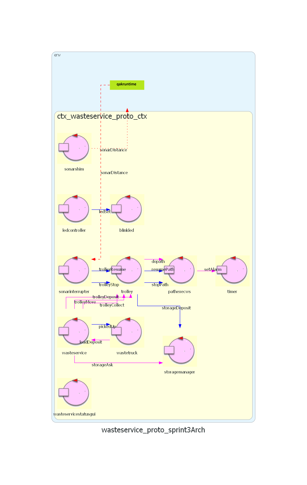

## Analisi del problema

### Componenti

#### Requisito **sonar-stop** - componenti

Emergono due opzioni principali su come gestire il Led:

- Usare un solo attore Sonar che interagisce direttamente con il dispositivo sonar tramite la libreria e il software fornito e comunica al trolley i messaggi di stop e resume.

- Dividere gli incarichi tra due componenti:
    - SonarShim, che interagirebbe con il sonar tramite la libreria o il
    software fornito, così da introdurre nel sistema Qak i dati del sonar senza conoscere il dominio.
    - SonarInterrupter, che rileverebbe la distanza attuale del sonar comunicata da SonarShim e farebbe il confronto con DLIMIT, inviando i messaggi *trolleyStop* e *trolleyResume* al Trolley.

**Conclusione.** Si ritiene migliore la seconda opzione, vale a dire **dividere gli incarichi**, visto che rispetta il principio di singola responsabilità. Inoltre, questo permetterebbe il riutilizzo dell'attore SonarShim in altri contesti, essendo agnostico al dominio.

### Interazione

Per questo scopo, è opportuno far sì che *trolleyStop* attivi un **interrupt**, vale a dire un tipo speciale di transizione Qak che permette di ritornare allo stato in cui è stata chiamata a fine interruzione (segnalata con apposiat keyword Qak). In questo modo, alla ripresa delle operazioni del sonar tornerebbe al lavoro lasciato in sospeso. Quindi, per il funzionamento di Qak, per permettere questa funzionalità *trolleyStop* e *trolleyResume* dovranno essere dispatch:

```
Dispatch trolleyStop : trolleyStop(_)
Dispatch trolleyResume : trolleyResume(_)
```

Per il modo in cui SonarShim invia i dati sulla distanza, si aprono come per Led e Gui due metodi possibili:

- L'uso di osservabilità, vale a dire SonarInterrupter che osserva SonarShim con COaP o altri metodi per rimanere aggiornato sui dati.

- L'uso di eventi, cioè SonarShim che emette a ogni aggiornamento sulla distanza un evento Qak contenente la nuova distanza.

**Conclusione.** A differenza che per Led e Gui, è stato scelto di usare **eventi**: in questo caso è necessario interagire attivamente e non passivamente con il contesto esistente, quindi l'uso di eventi è più semplice e preferibile, non richiedendo la conoscenza degli attori coinvolti dall'una o dall'altra parte (SonarShim o SonarInterrupter).

```
Event sonarDistance : sonarDistance(DIST).
```


### Modifiche

Trolley, come da SPRINT precedenti, usa l'attore *pathexec* di BasicRobot22 per gestire il movimento. Se si usasse l'attore così com'è, anche se si inviasse un messaggio *trolleyStop* il trolley finirebbe il movimento attuale prima di fermarsi, non essendo pathexec a conoscenza del segnale di stop. Si è deciso di modificare *pathexec* creando una nuova versione, **pathexecstop**, per permettergli di accettare gli interrupt lanciati da SonarInterrupter.

Sono quindi introdotti due dispatch per fermare e riprendere l'esecuzione di *pathexecstop*:

```
Dispatch stopPath : stopPath(_)
Dispatch resumePath : resumePath(_)
```

Potrebbero essere inviati da SonarInterrupter oppure da Trolley; si è deciso di farli inviare da Trolley, cosicchè esso rimanga l'unico attore che comunica con *pathexecstop*.

Viene incluso nel modello finale dell'architettura logica un semplice esempio di questa interazione.

### Lettura dal sonar

Riguardo al metodo di lettura della distanza rilevata dal sonar, sono possibili due metodi principali:

- Polling dei dati: SonarShim dovrebbe avere un thread che periodicamente (e rapidamente) controlla la distanza attuale rilevata.

- Osservazione: SonarShim osserva passivamente la distanza del sonar, e viene aggiornato sulle sue modifiche.

**Conclusione.** Ovviamente la seconda opzione, **l'osservazione**, migliora la performance ed è più pulita. Il problema principale è che allo stato attuale la libreria *radarsystem.domain* non supporta questa operazione, e non è possibile estenderla dall'esterno per farlo senza riprogrammare diverse classi fondamentali, perdendo lo scopo dell'usare una libreria. È stato quindi deciso di estendere la libreria per supportare l'osservabilità (almeno da pochi osservatori come per questo caso): per documentazione, analisi e progetto si consulti [il documento apposito](./radarSystem.domain_edits.md).


### Divisione dei contesti

Fin'ora i contesti dei vari attori sono stati uniti per semplificare lo sviluppo; per l'effettiva distribuzione gli attori eseguiranno generalmente su contesti diversi in dispositivi diversi, e i contesti sono stati separati di conseguenza:


La maggior parte è autoesplicativa; per quanto riguarda sonarinterrupter, è stato deciso di metterlo insieme al Trolley data la sua necessaria conoscenza di esso per via dell'interazione tramite dispatch. Un'alternativa sarebbe potuta essere introdurlo in ctx_raspberry, ma dopo quel contesto avrebbe necessitato conoscenza degli specifici attori di ctx_trolley, che al momento non era necessaria.

Si ricordi che Qak è usato come linguaggio di modellazione, ma non necessariamente i vari componenti rappresentati come attori rimarranno tali in sviluppo; comunque, i componenti nello stesso contesto saranno eseguiti nello stesso nodo.

Nota: nel prototipo eseguibile di questo SPRINT, sono stati comunque considerati attori nello stesso contesto, per semplicità.


### Architettura Logica

Ecco quindi l'architettura logica finale del sistema in generale per questo SPRINT:


[**Modello eseguibile generale / prototipo.**](../wasteservice.prototype/src/prototype_sprint3.qak)

Incluso anche il grafico corrispondente generato tramite Qak 3.0.



(Nota: l'attore timer non è un effettivo prodotto di analisi, ma solo un workaround a una limitazione attuale del framework Qak: non sarà presente nel progetto necessariamente.)

### Test Plan

#### TestPlan: sonar-stop

- **Test sonar-stop**: [TestSonarStop.kt](../wasteservice.prototype/test/it/unibo/TestSonarStop.kt). Versione aggiornata del test plan formalizzato in analisi dei requisiti. Invio di *trolleyMove* e durante il percorso inviare *sonarUpdate* sotto e sopra DLIMIT, controllando che il trolley si fermi e riprenda correttamente. Questo è di fatto un test per l'attore *sonarinterrupter*, per *sonarshim* vedi sotto.

- **Test sonarshim**: [TestSonarShim.kt](../wasteservice.prototype/test-disabled/TestSonarShim.kt). Non eseguibile data l'assenza di un effettivo sonar da controllare nel prototipo di analisi. Forza l'invio di certi dati da parte del sonar, e controlla la corretta emissione dell'evento da parte di *sonarshim*.
