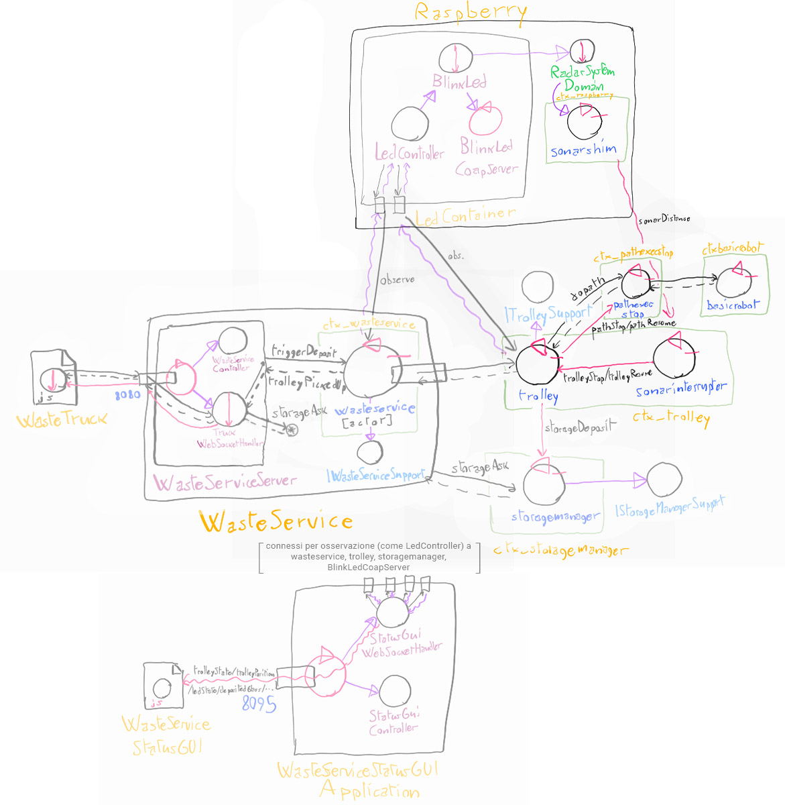

## Progettazione

La progettazione e lo sviluppo delle componenti software stabilite in fase di analisi è stata divisa in questo modo:

- SonarShim, SonarInterrupter : L. Guerra
- Sistemare Pathexec: F. Lenzi

Cose da aggiungere: 
- Modifiche a wasteservice.core
- Aggiunte a cose di altri sprint
    - truck gui resettabile
    - Posizione TRAVEL per meglio gestire posizioni e blinkaggio

### Struttura del software

Dato che entrambi i componenti interagiscono con il sistema Qak, verranno
realizzati come attori, osservabili attraverso Coap.

I nuovi componenti componenti sono contenuti in un nuovo progetto, *wasteservice.sonar*, che contiene l'intera parte relativa al sonar da integrare al resto del sistema.

La struttura dei package diventa la seguente (evidenziati solo i cambiamenti importanti):

- wasteservice.shared
    - *it.unibo.lenziguerra.wasteservice* (aggiunti nuovi enumerativi, test fixture, e classi minori)
    - it.unibo.lenziguerra.wasteservice.utils
    - + *it.unibo.lenziguerra.wasteservice.data* (classi dati, vedi sotto)
- wasteservice.core
    - it.unibo.lenziguerra.wasteservice.wasteservice
    - it.unibo.lenziguerra.wasteservice.trolley
    - it.unibo.lenziguerra.wasteservice.storage
- wasteservice.led
    - *it.unibo.lenziguerra.wasteservice.led*
- wasteservice.statusgui
    - *it.unibo.lenziguerra.wasteservice.statusgui*
- **wasteservice.sonar**
    - *it.unibo.lenziguerra.wasteservice.sonar*

### Modifiche a progetto core

In questo caso sarà necessario modificare il progetto core per permettere al
trolley di interrompersi in seguito agli interrupt forniti da SonarInterrupter.

### Sonar

Il Sonar, come da analisi, viene gestito tramite la libreria già realizzata *it.unibo.radarSystem22.domain*, che a sua volta interagisce con il software del committente (*SonarAlone*).

Come sopra i due componenti da analisi (SonarShim e SonarInterrupter) sono realizzati come attori Qak. In particolare, vengono realizate queste classi:

### Test

### Struttura del sistema

La struttura finale del sistema nello SPRINT 3 è riassunta in questo grafico: 

### Immagine Docker

<!-- Vengono forniti i file docker-compose elencati in seguito. Ci si può connettere alla porta 8080 per aprire l'interfaccia per i WasteTruck usata per inviare richieste, alla porta 8090 per visualizzare l'ambiente virtuale del robot, e alla porta 8095 per visualizzare WasteServiceStatusGUI. -->

<!-- - [wasteservice3.yaml](../wasteservice2_withledmock.yaml): esegue tutto il sistema in locale, usando un mock per il Led che stampa lo stato attuale su standard output. -->

<!-- - [wasteservice2\_noled.yaml](../wasteservice2_noled.yaml): esegue il sistema senza la parte di wasteservice.led; essa va eseguita fuori da Docker sul Raspberry Pi, il quale IP va configurato dentro a questo file yaml nel campo **wasteservice.led** sotto **extra_hosts** del servizio **wasteservice.statusgui**. Per trasferire facilmente i file di distribuzione al Raspberry Pi viene fornito lo script [scpDistrToRasp.sh](../wasteservice.led/scpDistrToRasp.sh), dove occorre configurare l'hostname/IP del raspberry al posto di `raspi` nei vari comandi. -->

