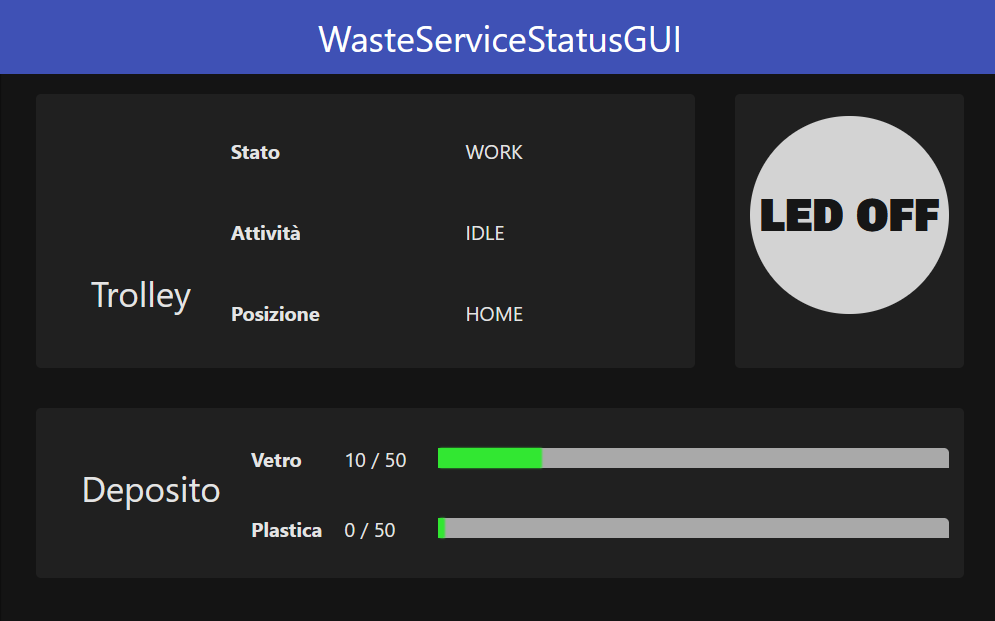

## Progettazione

La progettazione e lo sviluppo delle componenti software stabilite in fase di analisi è stata divisa in questo modo:

- SonarShim, SonarInterrupter : L. Guerra
- PathexecStop, aggiornamento radarsystem22.domain: F. Lenzi

### Struttura del software

Dato che entrambi i componenti relativi al Sonar interagiscono con il sistema Qak, verranno realizzati come attori.

I componenti sono stati contenuti in due nuovi progetti:
- *wasteservice.sonar*: componenti relativi al Sonar.
- *wasteservice.pathexec*: attore pathexec modificato in pathexecstop.

Inoltre, è stato aggiunto un progetto per semplificare il collaudo tramite Docker di Led e Sonar: *wasteservice.raspgui*, che fornisce una webapp contenente simulazioni dei componenti Led e Sonar.

Sono anche state svolte migliore, correzioni, e pulizia ai componenti degli SPRINT precedenti.

La struttura dei package diventa la seguente (evidenziati solo i cambiamenti importanti):

- wasteservice.shared
    - it.unibo.lenziguerra.wasteservice
    - it.unibo.lenziguerra.wasteservice.utils
    - it.unibo.lenziguerra.wasteservice.data
- wasteservice.core
    - it.unibo.lenziguerra.wasteservice.wasteservice
    - it.unibo.lenziguerra.wasteservice.trolley
    - it.unibo.lenziguerra.wasteservice.storage
    - *`wasteservice.qak`* (Aggiunta di sonarinterrupter, modifica di trolley per permettere lo stop)
- wasteservice.led
    - it.unibo.lenziguerra.wasteservice.led
- wasteservice.statusgui
    - it.unibo.lenziguerra.wasteservice.statusgui
- **wasteservice.sonar**
    - *it.unibo.lenziguerra.wasteservice.sonar*
    - *`sonar.qak`*
- **wasteservice.pathexec**
    - *`pathexecstop.qak`*
- (**wasteservice.raspgui**)


### Sonar

Il Sonar, come da analisi, viene gestito tramite la libreria già realizzata *it.unibo.radarSystem22.domain*, che a sua volta interagisce con il software del committente (*SonarAlone*). La libreria, come è stato detto in analisi, è stata estesa, con le modifiche visibili al [documento apposito](radarSystem.domain_edits.md).

Come sopra i due componenti da analisi (SonarShim e SonarInterrupter) sono realizzati come attori Qak. Il funzionamento di *sonarinterrupter* è equivalente all'analisi, mentre SonarShim è ora un CodedQActor con la classe apposita [`SonarShim`](../wasteservice.sonar/src/it/unibo/lenziguerra/wasteservice/sonar/Sonar.kt).

```Kotlin
class SonarShim(name : String) : ActorBasic(name) {
    [...]
    override suspend fun actorBody(msg: IApplMessage) {
        if (msg.msgId() == "sonarStart") {
            observer = DistanceObserver()
            observableDistance.subscribe(observer)
            sonar.activate()
        }
    }

    inner class DistanceObserver : IDistanceObserver {
        override fun update(distance: IDistance) {
            runBlocking {
                emit("sonarDistance", "sonarDistance(${distance.`val`.toString()})")
            }
        }
    }
}
```

Questa classe contiene un DistanceObserver, che registra al sonar osservabile con le modalità di *radarsystem22.domain* 2.0, e "rimbalza" gli aggiornamenti sulla distanza come evento.

### Trolley stop

È stato necessario modificare l'attore *trolley* per usare le primitive *whenInterrupt* di Qak per supportare lo stato di stop causato da *sonarinterrupter*. È stato possibile farlo senza modificare per questo scopo la classe di supporto `TrolleySupport` sottostante.

```
	State idle {
		[...]
	}
	Transition t0 [...]
				  whenInterrupt trolleyStop -> handleStop

	State handleMove {
		[...]
			[# WaitingPath = true #]
		[...]
	}
	Transition t0 [...]
				  whenInterrupt trolleyStop -> handleStop

  	State handleStop {
  		[# Support.updateState("stopped") #]
		updateResource [# Support.getPrologContent() #]
  		  		
  		if [# WaitingPath #] {
  			forward pathexecstop -m stopPath : stopPath(_)
  		}
  	}
  	Transition t0 whenMsg trolleyResume -> exitFromStop

    State exitFromStop {
   		[# Support.updateState("work") #]
		updateResource [# Support.getPrologContent() #]
  		  		   			
  		if [# WaitingPath #] {
  			forward pathexecstop -m resumePath : resumePath(_)
  		}
  		
  		returnFromInterrupt
  	}
```

Ci sono due possibili stati dove innescare l'interruzione, e in base ad essi può inviare un segnale di stop anche a *pathexecstop* o meno.

Per SonarShim è stato realizzato un main particolare, che sostituisce le impostazioni di host e IP del file Qak con quelle incluse in *SystemConfig.json*.

### PathexecStop

L'attore modificato *pathexecstop* è stato posto in un progetto dedicato, *unibo.pathexecstop*. Si limita ad entrare in uno stato di stop quando arrivano i dispatch *stopPath* e *resumePath*.

```
 	State doMoveW{
		[...]
	}	
	Transition t0 [...]                      
  				  whenInterrupt stopPath -> stopped

    State doMoveTurn {
		[...]
	}
	Transition t0 [...]
				  whenInterrupt stopPath -> stopped

```

### RaspGUI

Per collaudare meglio il sistema durante lo sviluppo, è stata realizzata una Web-app che simula sia Led che sonar tramite GUI. Questo permette anche di usarla internamente a Docker, che altrimenti non permetterebbe di usare Gui tradizionali realizzate con Swing e simili librerie.

### Modifiche minori

Sono state apportate migliore e correzioni agli SPRINT precedenti, riassunte in seguito:

* Migliorata l'interfaccia di WasteServiceStatusGUI e della GUI per i piloti dei camion.
* Aggiunta la possibilità di inviare nuove richieste dalla TruckGui senza aggiornare la pagina
* Aggiunto il campo Activity allo stato del Trolley, che indica se sia idle, se stia viaggiando, raccogliendo, o depositando oggetti, per aggiungere informazioni utili al collaudo e in generale.
* Aggiunto "Travel" come posizione del Trolley visualizzata quando non è fermo in una posizioni di interesse, sia per rappresentare meglio i fatti (prima il Trolley era visualizzato come a HOME anche quando era già in viaggio per INDOOR), e aggiornare prima lo stato del Led (così che cominci a lampeggiare più appropriatamente appena il Trolley abbandona HOME).





### Test

Sono stati aggiornati i test plan formalizzati in analisi del problema.

- **Test sonar-stop**: [TestSonarStop.kt](../wasteservice.core/test/it/unibo/lenziguerra/wasteservice/TestSonarStop.kt). Funzionamento analogo all'analisi del problema.

- **Test sonarshim**: [TestSonarShim.kt](../wasteservice.sonar/test/it/unibo/lenziguerra/wasteservice/sonar/TestSonarShim.kt). Ora eseguibile, sfrutta la modalità testing del SonarMock di radarsystem.domain per controllare gli output del Sonar.

In luce delle tecniche apprese durante lo sviluppo di SPRINT 2 e SPRINT 3, sono stati aggiornati anche i test dello SPRINT 1, per permetterne l'esecuzione in massa (avviandoli "dalla classe") e senza necessitare l'avvio di componenti esterni come basicrobot; questo è stato fatto creando un attore pathexec fasullo, che ha permesso anche di verificare il corretto movimento del Trolley.

- **TestRequest**: [TestRequest.kt](../wasteservice.core/test/it/unibo/lenziguerra/wasteservice/wasteservice/TestRequest.kt)
- **TestDeposit**: [TestDeposit.kt](../wasteservice.core/test/it/unibo/lenziguerra/wasteservice/TestDeposit.kt)
- **TrolleyTest**: [TrolleyTest.kt](../wasteservice.core/test/it/unibo/lenziguerra/wasteservice/TrolleyTest.kt)
- **TestMoreRequests**: [TestMoreRequests.kt](../wasteservice.core/test/it/unibo/lenziguerra/wasteservice/TestMoreRequests.kt)


### Struttura del sistema

La struttura finale del sistema nello SPRINT 3 è riassunta in questo grafico: 


Senza l'evidenziazione delle sole componenti modificate o nuove:


### Immagine Docker

Vengono forniti i file docker-compose elencati in seguito. Ci si può connettere alla porta 8080 per aprire l'interfaccia per i WasteTruck usata per inviare richieste, alla porta 8090 per visualizzare l'ambiente virtuale del robot, e alla porta 8095 per visualizzare WasteServiceStatusGUI.

- [wasteservice3\_withmockgui.yaml](../wasteservice3_withmockgui.yaml): esegue tutto il sistema in locale, usando la webapp *raspGui* menzionata precedentemente come mock di Led e Sonar, accessibile alla porta 8096.

- [wasteservice3_norasp.yaml](../wasteservice3_norasp.yaml): esegue il sistema senza le componenti Led e Sonar; esse vanno eseguite fuori da Docker sul Raspberry Pi, il quale IP va configurato dentro a questo file yaml nel campo **wasteservice.led** sotto **extra_hosts** del servizio **wasteservice.statusgui**. Per trasferire facilmente i file di distribuzione al Raspberry Pi vengono forniti gli script **scpDistrToRasp.sh** in [wasteservice.led](../wasteservice.led/scpDistrToRasp.sh) e [wasteservice.sonar](../wasteservice.sonar/scpDistrToRasp.sh), dove occorre configurare l'hostname/IP del raspberry al posto di `raspi` nei vari comandi.

