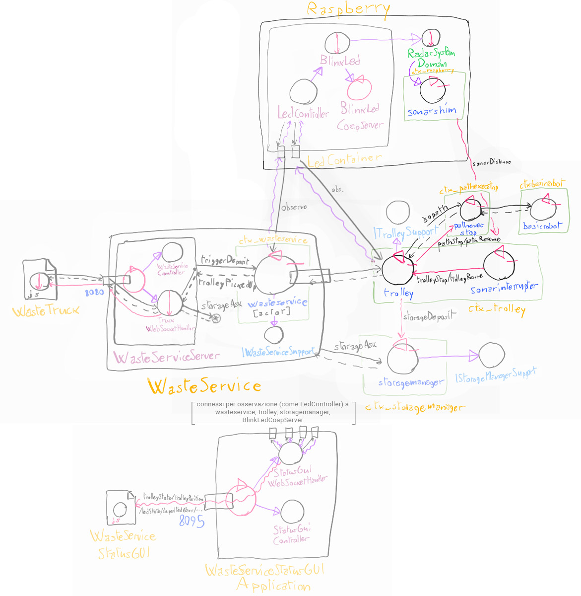

## Riassunto SPRINT 3

Il terzo SPRINT riguardava questi requisiti:

- **sonar-stop**: è presente un *sonar* che, se misura una distanza sotto DLIMIT (valore prefissato), mette il *trolley* in stato di *stop* fino a che la distanza non torna a DLIMIT, nel qual caso il *trolley* riparte

### Analisi

In fase di analisi, è stato deciso di dividere Sonar in due componenti, SonarShim sul contesto del Raspberry che emette eventi di aggiornamento sulla distanza usando la libreria *radarsystem22.domain*, e SonarInterrupter sul contesto del Trolley (data la necessità di conoscerlo per inviare dispatch) che ferma quest'ultimo tramite interrupt. Inoltre, è stato deciso di creare una versione estesa dell'attore Pathexec di BasicRobot22 che sia possibile interrompere a metà di un percorso.

Dopo la fase di analisi, l'architettura logica del sistema è stata così pensata:

[**Modello eseguibile generale / prototipo.**](../wasteservice.prototype/src/prototype_sprint3.qak)

Per interagire con il sonar è stato usato il software fornito dal committente, SonarAlone.c, controllato tramite la libreria *radarsystem22.domain*, aggiornata in fase di sviluppo per permettere l'osservabilità della distanza rilevata dal sonar.

Sono stati realizzati, in fase di analisi, dei test plan in parte eseguibili sfruttando il prototipo in Qak, per ogni componente e/o requisito. Sono dettagliati nella sezione apposita, e collegati di seguito:

- [TestSonarStop.kt](../wasteservice.prototype/test/it/unibo/TestSonarStop.kt)
- [TestSonarShim.kt](../wasteservice.prototype/test-disabled/TestSonarShim.kt) (Non eseguibile, per ragioni spiegate nel documento di analisi).

### Progetto

I punti salienti della fase di sviluppo sono i seguenti:

- Aggiornamento della libreria *radarsystem22.domain* per permettere osservabilità di sonar e distanza rilevata dal sonar.

- Realizzazione di SonarShim come osservatore della distanza del sonar che la "rimbalza" come evento al contesto Qak del Trolley.

- SonarInterrupter realizzato in modo analogo al modello dell'analisi, e Trolley modificato di conseguenza per accettare stop e resume.

- Realizzazione di unibo.pathexecstop per permettere l'interruzione dell'esecuzione del percorso.

- Migliorie e correzioni minori generali alle componenti pre-esistenti del sistema.

I test dell'analisi sono stati adattati all'implementazione:

- **Test sonar-stop**: [TestSonarStop.kt](../wasteservice.core/test/it/unibo/lenziguerra/wasteservice/TestSonarStop.kt)
- **Test sonarshim**: [TestSonarShim.kt](../wasteservice.sonar/test/it/unibo/lenziguerra/wasteservice/sonar/TestSonarShim.kt)

E sono stati migliorati i test dello SPRINT 1 in luce delle tecniche apprese, per evitare la necessità di lanciare programmi terzi:

- **TestRequest**: [TestRequest.kt](../wasteservice.core/test/it/unibo/lenziguerra/wasteservice/wasteservice/TestRequest.kt)
- **TestDeposit**: [TestDeposit.kt](../wasteservice.core/test/it/unibo/lenziguerra/wasteservice/TestDeposit.kt)
- **TrolleyTest**: [TrolleyTest.kt](../wasteservice.core/test/it/unibo/lenziguerra/wasteservice/TrolleyTest.kt)
- **TestMoreRequests**: [TestMoreRequests.kt](../wasteservice.core/test/it/unibo/lenziguerra/wasteservice/TestMoreRequests.kt)

Vengono forniti i file Docker-compose elencati in seguito. Ci si può connettere alla porta 8080 per aprire l'interfaccia per i WasteTruck usata per inviare richieste alla porta 8090 per visualizzare l'ambiente virtuale del robot e alla porta 8095 per visualizzare WasteServiceStatusGUI.

Vengono forniti i file docker-compose elencati in seguito. Ci si può connettere alla porta 8080 per aprire l'interfaccia per i WasteTruck usata per inviare richieste, alla porta 8090 per visualizzare l'ambiente virtuale del robot, e alla porta 8095 per visualizzare WasteServiceStatusGUI.

- [wasteservice3\_withmockgui.yaml](../wasteservice3_withmockgui.yaml): esegue tutto il sistema in locale, usando la webapp *raspGui* come mock di Led e Sonar, accessibile alla porta 8096.

- [wasteservice3_norasp.yaml](../wasteservice3_norasp.yaml): esegue il sistema senza le componenti Led e Sonar; esse vanno eseguite fuori da Docker sul Raspberry Pi, il quale IP va configurato dentro a questo file yaml nel campo **wasteservice.led** sotto **extra_hosts** del servizio **wasteservice.statusgui**. Per trasferire facilmente i file di distribuzione al Raspberry Pi vengono forniti gli script **scpDistrToRasp.sh** in [wasteservice.led](../wasteservice.led/scpDistrToRasp.sh) e [wasteservice.sonar](../wasteservice.sonar/scpDistrToRasp.sh), dove occorre configurare l'hostname/IP del raspberry al posto di `raspi` nei vari comandi.
