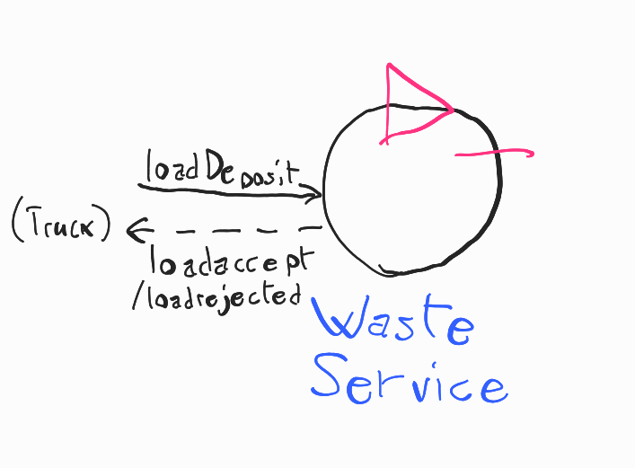

[Ritorna all'inizio](README.md)

# WasteService - Analisi dei Requisiti

## Requisiti e chiarimenti

Per ogni requisito è stato incluso un modello eseguibile in [Qak](#scelta-del-linguaggio-di-modellazione). 

- **request**: il *WasteService* accetta richieste di deposito da *Waste truck* che arrivano nella zona specificata come INDOOR, che specificicano il tipo di materiale da depositare
    - il sistema può controllare se c'è spazio per un certo materiale: accetta (risposta *loadaccept*), e rifiuta (risposta *loadrejected*) le richieste di deposito in caso contrario
    1. > Domanda: le richieste possono essere gestite anche mentre il robot è in attività?

        Sì, potrebbe arrivare altro camion che chiede.

    2. > Domanda: solo un camion alla volta in INDOOR?

        Sì.

- **deposit**: il *trolley*, quando viene attivato, raccoglie i materiali a INDOOR, e li deposita, in base al tipo, in GLASS BOX o PLASTIC BOX; questa è una *deposit action*:
    1. Raccolta di rifiuti da *Waste truck* in INDOOR
    2. Andare da INDOOR a contenitore rifiuti (* BOX)
    3. Depositare rifiuti nel contenitore

- **indoor-more-requests**: il *trolley*, terminata una *deposit action*, torna a HOME solo se non ci sono altre richieste da gestire, sennò gestisce subito la richiesta successiva andando a INDOOR

- **led**: nel sistema è presente un led che:
    - è *acceso* se il *trolley* è a HOME
    - *lampeggia* se il *trolley* è in attività
    - è *spento* se il trolley è in stato di *stop*

- **sonar-stop**: è presente un *sonar* che, se misura una distanza sotto DLIMIT (valore prefissato), mette il *trolley* in stato di *stop* fino a che la distanza non torna a DLIMIT, nel qual caso il *trolley* riparte
    1. > Domanda: cosa vuol dire precisamente *stop*? Torna a HOME o rimane lì?

        Si ferma e basta.

- **gui**: è presente una gui (*WasteServiceStatusGUI*) che mostra i seguenti dati:
    - Stato del *trolley* e sua posizione
    1. > Domanda: Posizione del trolley: deve essere precisa o informazione più generale (INDOOR, in mezzo, HOME, ecc)?
    
        Basta una posizione più generale.
    - Carico depositato attuale (in kg)
    - Stato del Led (acceso/spento/lampeggiante)

Da questa analisi, emerge che il *core business* del sistema è costituito dai requisiti di **request**, **deposit**, e **indoor-more-requests**. Un primo sprint SCRUM sarà quindi lo sviluppo a partire da questi requisiti centrali, mentre i successivi sprint implementeranno le funzionalità aggiuntive di **led**, **sonar-stop**, e **gui**.

## Glossario

- *WasteService*: il servizio centrale che risponde alle richieste dei *waste truck*

- *Waste truck*: i camion che arrivano dall'esterno a depositare rifiuti

- Area di servizio: **INDOOR**, **PlasticBox**, **GlassBox**, aree definite nella creazione del sistema e punti di riferimento per il *trolley*. In particolare:
    - INDOOR: area dove i *waste truck* si fermano a lasciare il proprio carico, facendo una richiesta di deposito. Essa può contenere un *waste truck* alla volta
    - PlasticBox: area dove depositare la plastica
    - GlassBox: area dove depositare il vetro

- *transport trolley* (o *trolley*): robot DDR (differential drive robot), di dimensione approssimabile a quadrato di lato RD, usato per trasportare i rifiuti nel sistema

- *Service-manager*: umano che supervisiona il sistema tramite la *WasteServiceStatusGUI*

- *Sonar*: sensore che misura distanza

- *Led*: spia luminosa

## Analisi dei requisiti

Guardando i requisiti definiti dal committente si possono fare delle prime analisi sul da farsi.

### Analisi **request**

Si tratta di una domanda con risposta, quindi l'implementazione immediata è request-reply:

```
Request loadDeposit : loadDeposit(MAT, QNT)
Reply loadaccept : loadaccept()
Reply loadrejected : loadrejected()
```



Il WasteService deve di conseguenza essere un attore, in grado di ricevere richieste e inviare risposte, e anche inviare messaggi a sua volta alle altre componenti del sistema.

```
Context ctxwasteservice ip [host="localhost" port=8050]

QActor wasteservice context ctxwasteservice {...}
```

[Modello eseguibile Request](./model.requisiti/src/request.qak)

Viene definito un primo test plan, eseguibile con le classi generate dal modello eseguibile:

[Test plan Request](./model.requisiti/test/it/unibo/TestRequest.java)

### Analisi **deposit**

È presente nel sistema un *trolley*; visto che necessita di trovarsi in un altro nodo rispetto al WasteService, e di comunicare con esso, viene modellato come un attore: *Trolley*.

Esso, da requisiti, usa un robot DDR che *lavora come trolley*. Sono già fornite componenti software che implementano il controllo di un robot DDR tramite operazioni primitive (vedi [Materiale fornito dal committente](#materiale-fornito-dal-committente)), cioè BasicRobot22. Quindi, il Trolley dovrà interagire con BasicRobot22 tramite i comandi primitivi di quest'ultimo, per controllare il robot DDR.

L'interazione tra *Trolley* e *WasteService* riguardante l'innesco e lo svolgimento di una *deposit action* lascia invece aperte diverse opzioni, che sono discusse successivamente in fase di analisi del problema. 

La struttura dell'operazione è descritta nel modello eseguibile seguente:

[Modello eseguibile Deposit](./model.requisiti/src/deposit.qak)

Viene definito un primo test plan, eseguibile con le classi generate dal modello eseguibile:

[Test plan Deposit](./model.requisiti/test/it/unibo/TestDeposit.java)

### Analisi **indoor-more-requests**

Dal requisito in sè non è possibile definire con più precisione l'interazione precisa interna al sistema che lo adempie, rimanendo punti aperti diversi elementi fondamentali (i tipi di interazione tra componenti del sistema). Viene definito un test plan primitivo in seguito:

[Test plan Indoor-More-Requests](./model.requisiti/test/it/unibo/TestIndoorMoreRequests.java)

## Materiale fornito dal committente

- Robot DDR: viene fornita una componente software, *BasicRobot22*, che implementa comandi primitivi *MOVE = w | s | l | r | h*, e permette di fare *step* in avanti per un certo tempo.
- Sonar: viene fornito un programma in C, *SonarAlone.c*, che stampa su standard output la distanza attualmente rilevata dal sonar, configurando le porte GPIO in questo modo:
    - Porta VCC : pin fisico 4 (+5v)
    - Porta GND : pin fisico 6 (GND)
    - Porta TRIG: pin fisico 11 (WPI 0, BCM 17)
    - Porta ECHO: pin fisico 13 (WPI 2, BCM 27)
- Led: vengono forniti gli script bash e *led25GpioTurnOn.sh* e *led25GpioTurnOff.sh* per accendere e spegnere un Led connesso alla porta GPIO 25 di un Raspberry Pi.

## Scelta del linguaggio di modellazione

Nelle varie fasi di analisi di questo progetto abbiamo usato come linguaggio di modellazione il linguaggio ad attori Qak, essendo il sistema da realizzare un sistema distribuito, quindi adatto ad essere rappresentato tramite attori.
